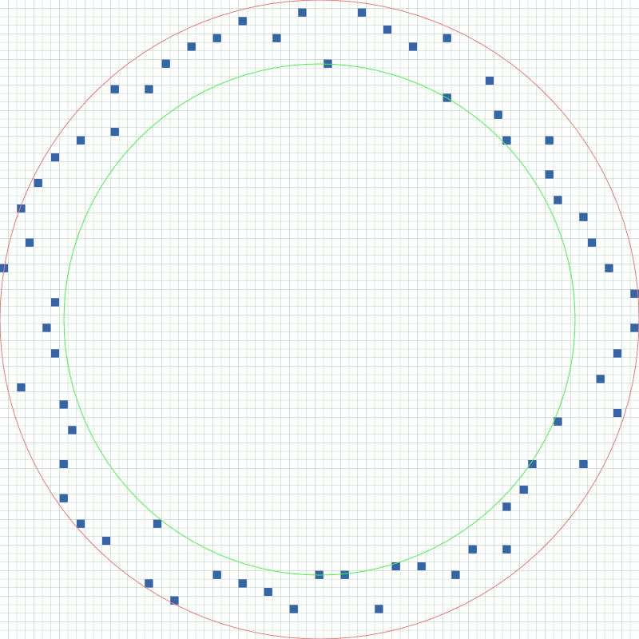
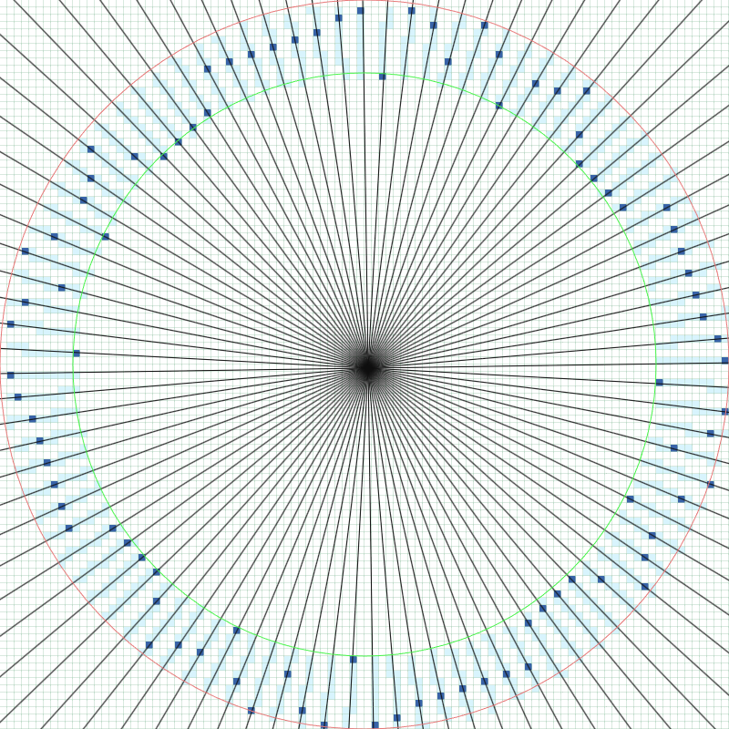

# Try it out

https://beacons.edznux.fr/

## Examples




## Why

Good explaination video on why a simple circle wouldn't work by [Squibble](https://www.youtube.com/@squibble111) (not affilliated in any ways):

[](https://www.youtube.com/watch?v=VcsEm7FnheU)

## Add features

### Ideas
- [ ] Export to Litematica / Schematica schematics to easily import in your world
- [ ] Support for customized beacon colors

### Local dev
Open index.html in your browser. (no need for a webserver)

### build
Don't update the .js, update the .ts file and run:
```
npx tsc --watch ./main.ts
```
